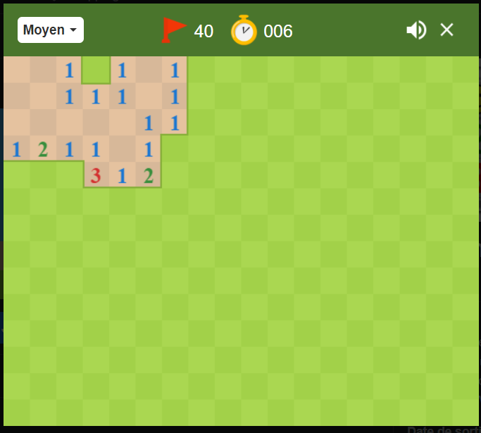
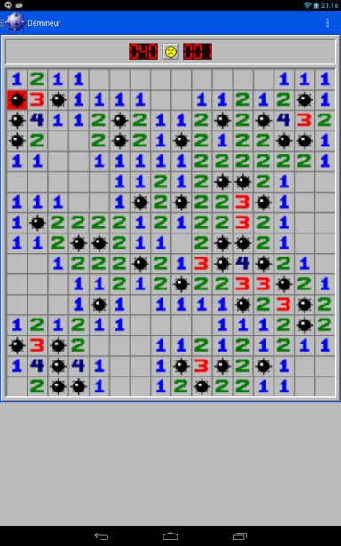
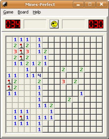

# Démineur

Reproduction du jeu classique intégré de Windows dans ses précédentes versions. Celui-ci n’est plus intégré mais on trouve beaucoup de versions alternatives:

#### Le but du jeu est le suivant :  
Le joueur joue sur une grille dont les cellules sont toutes masquées au démarrage (et dont certaines peuvent contenir des bombes) et doit révéler toutes les cellules qui ne contiennent pas de bombes. Dans certaines versions, on considère qu’il doit le faire le plus vite possible.
 
Pour faire cela, il peut cliquer sur une cellule afin de révéler son contenu. Si la cellule cliquée contenait une bombe, la partie est immédiatement perdue.

Si la cellule cliquée ne contenait pas de bombe, alors la partie peut continuer et la grille se découvre en réalisation la vérification suivante :
- Si la cellule cliquée (qui ne contenait pas de bombe donc) possède au moins une bombe dans son voisinage immédiat (une case autour dans toutes les directions, même les diagonales) alors cette cellule révèle le nombre de bombes dans ce voisinage immédiat et on s’arrête là.
- En revanche, si la cellule cliquée n’a aucune bombe dans ses voisins immédiats, alors celle-ci révèle une case vide, et le jeu va effectuer la vérification sur ses voisins immédiats également. De voisin en voisin, si beaucoup de cases visitées sont vides et non entourées de bombes, on peut révéler en un click un grand morceau de la grille. Le premier clic sur le tableau est toujours une case de ce type, garantissant que le joueur ne puisse pas perdre ou être bloqué sur son premier clic.

De déduction en déduction, on va essayer de découvrir toutes les cellules (vides et numérotées) qui ne contiennent pas de bombes.

Le joueur peut choisir la taille de la grille et le nombre de bombes. Il peut également marquer une case avec un drapeau pour indiquer une bombe qu'il a identifié, avec un clic-droit.
